# 🏥 Awesome Medical Practice Management 🩺

  

  
  
  
  

---

## 📌 Overview & SEO Insights
Welcome to the curated ecosystem directory of **Medical Practice Management (MPM)** software, **Electronic Health Record (EHR)** / **Electronic Medical Record (EMR)** systems, and **Revenue Cycle Management (RCM)** software. Whether you are managing an independent ambulatory clinic, specialized healthcare facilities, or deploying open-source medical IT infrastructure, this repository provides comprehensive market insights, valuation metrics, pricing structures, and community-driven healthcare tools.

### 📊 Market Size & Industry Dynamics
> 💡 **Market Size & Structure**: The global Medical Practice Management software market is estimated at **$11.5 Billion USD in 2026** (projected to reach **~$19.5 Billion USD by 2032** at a CAGR of ~9.1%). The sector is **moderately fragmented**. While enterprise EHR providers hold significant market share in large hospital networks, ambulatory care and specialized outpatient clinics remain highly fragmented across specialized SaaS tools and regional open-source frameworks.

---

## 📑 Table of Contents
- [💼 Commercial & SaaS Platforms](#-commercial--saas-platforms)
- [🔓 Open-Source GitHub Projects](#-open-source-github-projects)
- [🤝 How to Contribute](#-how-to-contribute)
- [💖 Support & Sponsorship](#-support--sponsorship)
- [⚠️ Disclaimer](#️-disclaimer)
- [📈 Star History](#-star-history)

---

## 💼 Commercial & SaaS Platforms

Below is a detailed comparison of top commercial medical practice management platforms. Entries are sorted in **descending order by company valuation / annual revenue size**.

| Product | 🏢 Valuation / Company Size | 💰 Specific Pricing Tier | 🎁 Free Tier / Trial Limit | ⚡ Key Capabilities & Focus |
| :--- | :--- | :--- | :--- | :--- |
| **[athenaOne](https://www.athenahealth.com/)** | **$17.0 Billion** (Valuation) / ~$2.5B Rev | Starts at **~4.0% – 7.0%** of monthly practice collections | **No Free Trial** (Guided product demo available upon inquiry) | Cloud-based EHR, practice management, and automated revenue cycle services for ambulatory groups. |
| **[AdvancedMD](https://www.advancedmd.com/)** | **$1.13 Billion** (Valuation) / ~$150M+ Rev | Starts at **$429/provider/month** (Medical PM/EHR) or **$0.87–$1.74/claim** | **30-Day Free Trial** (Available for self-service "AdvancedMD Now" product line) | Comprehensive suite for independent practices with flexible subscription or per-claim billing options. |
| **[Tebra (Kareo + PatientPop)](https://www.tebra.com/)** | **$1.0 Billion** (Valuation) / ~$112M+ Rev | Starts at **$150 – $799/provider/month** (depending on module bundle) | **No Free Trial** (Custom live demo & sandbox preview upon request) | All-in-one digital backbone combining Kareo PM/EHR with PatientPop patient growth and portal. |
| **[eClinicalWorks](https://www.eclinicalworks.com/)** | **~$2.8 Billion** (Est. Value) / ~$1.0B Rev | Starts at **$449/provider/month** (EHR) or **$599/provider/month** (EHR + PM) | **No Free Trial** (Free personalized workflow demonstration available) | Industry-leading cloud EHR/PM platform serving over 150,000 physicians across ambulatory clinics. |
| **[NextGen Healthcare](https://www.nextgen.com/)** | **$1.8 Billion** (Valuation) / ~$653M Rev | Starts at **$299 – $549/provider/month** (NextGen Office estimate) | **No Free Trial** (Guided discovery demo and consultation only) | Scalable ambulatory EHR & revenue cycle platform tailored for specialty practices and health centers. |
| **[Practice Fusion](https://www.practicefusion.com/)** | **~$250 Million** (Acquisition) / ~$50M+ Rev | Starts at **$199/provider/month** (Annual contract, includes 3 staff licenses) | **14-Day Free Trial** (Full access to charting & scheduling, no credit card required) | Intuitive cloud-based EHR and practice management ideal for small independent ambulatory practices. |
| **[CureMD](https://www.curemd.com/)** | **~$150 Million** (Est. Value) / ~$40M+ Rev | Starts at **$195/provider/month** (PM only) or **$395/provider/month** (PM + EHR) | **No Free Trial** (Free live virtual demonstration available) | Integrated EHR, specialty charting, and outsourced revenue cycle management services. |
| **[PrognoCIS](https://www.prognocis.com/)** | **~$80 Million** (Est. Value) / ~$25M+ Rev | Starts at **$280/provider/month** (Varies based on plugin & specialty modules) | **No Free Trial** (Tailored product demo provided by sales team) | Customizable EHR and practice management with specialized medical documentation workflows. |

---

## 🔓 Open-Source GitHub Projects

Explore popular open-source electronic health records, practice management frameworks, and interoperability engines. Entries are sorted in **descending order by GitHub Stars_Count** 🌟.

| Open-Source Project | 🌟 GitHub_Stars | 📖 Description & Technical Overview |
| :--- | :--- | :--- |
| **[ERPNext Healthcare](https://github.com/frappe/erpnext)** |  | Full-featured healthcare module within ERPNext covering patient registrations, clinical appointments, inpatient admissions, laboratory management, and clinic billing. |
| **[HospitalRun](https://github.com/hospitalrun/hospitalrun-frontend)** |  | Modern open-source offline-first electronic health records and hospital management system built for developing world clinics and rural healthcare providers. |
| **[OpenEMR](https://github.com/openemr/openemr)** |  | The premier ONC-certified open-source Electronic Health Record (EHR) and medical practice management solution featuring patient portal, scheduling, e-prescribing, and billing. |
| **[Medplum](https://github.com/medplum/medplum)** |  | Developer-focused open-source head-less EHR and healthcare platform based on HL7 FHIR standards for rapid clinical app development and patient portal creation. |
| **[HAPI FHIR Engine](https://github.com/hapifhir/hapi-fhir)** |  | Complete open-source HL7 FHIR specification implementation in Java for connecting practice management software with health information exchanges (HIEs). |
| **[OpenMRS Core](https://github.com/openmrs/openmrs-core)** |  | Enterprise open-source medical record system architecture designed for public-health deployments and global medical facilities. |
| **[CARE Healthcare Network](https://github.com/ohcnetwork/care)** |  | Open-source tele-ICU, patient management, and clinic workflow management system designed for public health response and hospital capacity tracking. |
| **[LibreHealth EHR](https://github.com/LibreHealthIO/lh-ehr)** |  | Clinician-friendly open-source EHR base platform derived from OpenEMR for clinical documentation and practice administration. |
| **[Bahmni OpenMRS Apps](https://github.com/Bahmni/openmrs-module-bahmniapps)** |  | Integrated hospital and practice management UI combining OpenMRS, OpenERP/Odoo, and dcm4chee PACS for low-resource settings. |

---

## 🤝 How to Contribute
Contributions are warmly welcomed! Help keep this directory accurate, comprehensive, and up to date:
1. 🍴 **Fork** this repository.
2. 📝 Add or update entries in `README.md` following the tabular layout.
3. 🔎 Ensure pricing, free trial limits, valuation, and GitHub star links are accurate.
4. 🚀 Submit a **Pull Request** with a brief summary of your changes.

---

## 💖 Support & Sponsorship
Thank you for using and exploring this medical practice management ecosystem directory! If you find this resource helpful for your clinic, research, or health-IT development, please consider supporting the project:

- ⭐ **Star this repository** on GitHub to help others discover it.
- 🍴 **Fork and share** it with practice administrators, clinicians, and software developers.
- ☕ **Buy me a coffee**: If you'd like to sponsor further open-source health-IT maintenance and research, you can support via the [GitHub Sponsor Dashboard](https://github.com/sponsors/ishandutta2007).

---

## ⚠️ Disclaimer
- **Community Curated**: This repository serves as an informational resource and market directory. It does not constitute commercial endorsement or software certification.
- **HIPAA & Compliance**: Medical practice management systems process Protected Health Information (PHI). Open-source deployments require hardened infrastructure, audit logging, access controls, and strict compliance with HIPAA, GDPR, or regional health regulations.

---

## 📈 Star History

---

  <b>Made with ❤️ for Practice Administrators, Clinicians, and Health-IT Engineers worldwide.</b>

